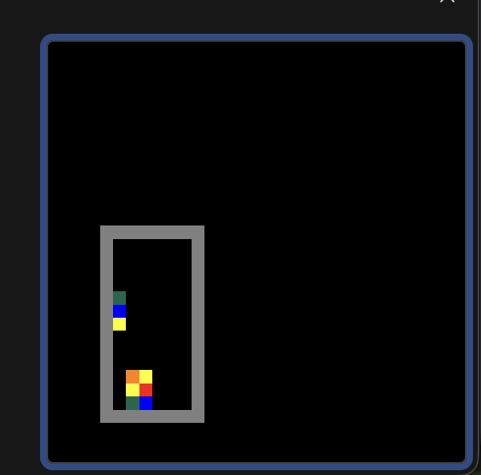

# Columns (MIPS Assembly Puzzle Game)

This repository contains my implementation of the classic **Columns** falling-block puzzle game written in **MIPS assembly** for a computer architecture course.

The game simulates falling multicolored blocks that players match in lines of three or more to clear them, similar in spirit to *Tetris*-style mechanics. Players use keyboard input to move and rotate blocks while the game tracks block stacking and line matching logic.

This project demonstrates:
- low-level control using **assembly language**
- memory-mapped I/O for display and input
- algorithmic logic implemented without high-level abstractions
- game loop, matching, and gravity mechanics

---

## Files in this Repository

| File | Description |
|------|-------------|
| `columns.asm` | Early build of the game logic |
| `columnsV1.3.asm` | Intermediate version with improvements |
| `columns_final.asm` | Final playable version |
| `columnsDemo1.png` | Screenshot of the game in action |
| `project_report.pdf` | Written report detailing design and implementation |
| `project-report.tex` / `.zip` | LaTeX source for the written report |

---

## How to Run

This game is designed to run in a **MIPS simulator** that supports:
- **Bitmap display**
- **Keyboard and Display memory-mapped I/O (MMIO)**

### Recommended Simulator
Use **MARS (MIPS Assembler and Runtime Simulator)**:
1. Download and open **MARS** (e.g., `Mars.jar`).
2. Open `columns_final.asm` from this repository.
3. Go to **Tools → Bitmap Display** and **connect**.
4. Go to **Tools → Keyboard and Display MMIO** and **connect**.
5. Assemble and run the program.
6. Use keyboard controls (typically arrow keys or WASD) to manipulate falling blocks.

**Note:** Make sure the bitmap display configuration matches the simulator’s requirements and that Keyboard MMIO is connected before running.

---

## Controls

| Action | Key |
|--------|-----|
| Move left | Left arrow / `A` |
| Move right | Right arrow / `D` |
| Rotate blocks | Up arrow / `W` |
| Drop faster | Down arrow / `S` |

*(Adjust based on the simulator’s key mapping if needed)*

---

## What You’ll See

The game displays a playfield with falling blocks. Your goal is to align three or more of the same color in a vertical or diagonal line to clear them. The game continues until the playfield fills.

Here’s a demo screenshot:

---

## Learning Outcomes

By building this project, I:
- practiced detailed control flow using MIPS assembly
- worked with memory-mapped output and real hardware-style I/O
- implemented game logic under strict low-level constraints

---

## License

This project is open-source and may be used or adapted for educational purposes.
